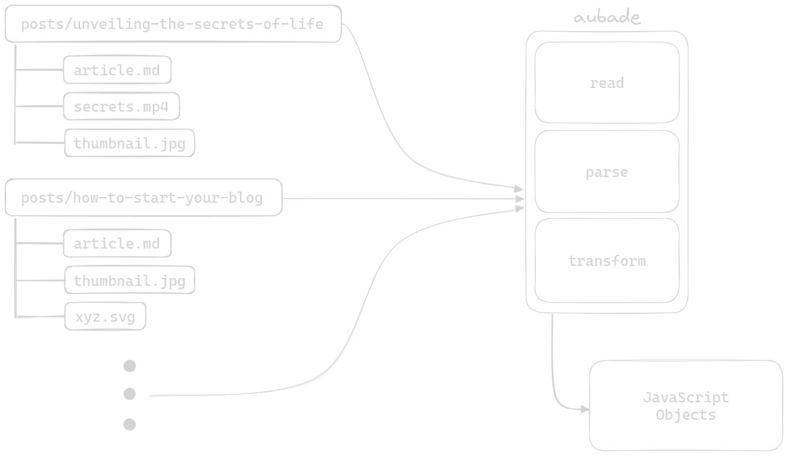

## What is Marqua?

Marqua is a data authoring framework for organizing your content away from your code. It is designed to be flexible and adaptable with any frameworks that has access to the filesystem and can process JavaScript objects or JSON files.

## Why separate content from code?

As either of your content or code grows, it becomes harder to maintain with everything mixed up together without any structure, and tracking changes will be a nightmare at some point. Separating the content from the code allows you to have full focus on one of them at a time, without getting distracted by the other.

<!-- "frameworks are not tools for organising your code, they are tools for organising your mind" - Rich Harris, https://www.youtube.com/watch?v=AdNJ3fydeao&t=412 -->

It will not only help the future you, but also your team and anyone who is going to work on the project. In addition, this will allow you to have a better workflow as both the content and code can be managed by its own team, respectively.

## How it works

Marqua includes a compiler with code syntax highlighting and built-in front matter parser that splits your markdown into two parts, `body` and `metadata`. The markdown compiler is powered by [markdown-it](https://github.com/markdown-it/markdown-it) and code syntax highlighter is powered by [Shikiji](https://github.com/antfu/shikiji). The [front matter parser](/docs/module-core#parse) for the `metadata` is powered by a lightweight in-house implementation, which supports a minimal subset of [YAML](https://yaml.org/) syntax and can be used as a standalone module.

Marqua only provides the necessary tools to help you with the initial layout and for you to create your own architecture and workflow, so you can have full control over your project. Simply start writing in a markdown file or use your existing markdown files and Marqua will help you easily turn them into a data source for your website.

